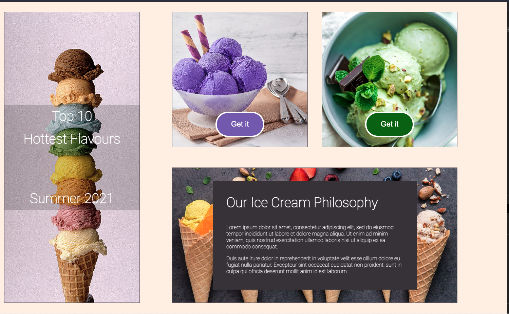
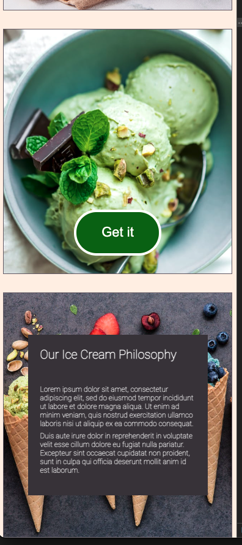

# Image layout

### General Info

- Link to mockup:

https://www.figma.com/file/kRIpfyZQj4LV19qKFpvLtA/New-Dev-Test?node-id=1%3A132

- Link to live site:

https://image-layout.vercel.app/

- To run the local project, pull and `yarn dev`, then access on `http://localhost:3000/`. By the way, I'm using **Next.js**.

- CSS reset, Roboto font, and background color are set in

https://github.com/gr-qft/image-layout/blob/main/styles/globals.css

- The main layout is written in

https://github.com/gr-qft/image-layout/blob/main/pages/index.js

and the style file is kept in

https://github.com/gr-qft/image-layout/blob/main/styles/Home.module.css

### Comments

- Since the goal is to achieve a responsive layout from the mockup, I've focused on using HTML and CSS and not on creating React components.
- In a real work environment, I would communicate with the designers to clarify what is wanted precisely for the UI in between the two screen sizes. Here I aim for a simple solution where there is one column for Iphone 8 size, a centered column for all sizes up until the desktop size.

- In a real work environment, I would also
  ask about the margin, padding, other measurements, and image assets.

- The demo is tested with browser developer tool as well as with a real Iphone X, an Ipad, and a desktop monitor. I've added extra CSS so that the layout look correct for all these cases.

### Screenshots

#### Fullscreen

#### Small screen

### Video screenshot

[vid](shots/vid.mov)
